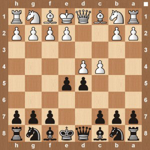

Chess openings list
===
+ [Adelaide Counter Gambit](adelaide-counter-gambit.md)

	

+ [Albin Counter-Gambit](albin2.md)

	

+ [Alekhine Defense](alekhinedefensebig.md)

	

+ [Belgrade Gambit](belgrade-gambit.md)

	

+ [Benoni Defense](the-benoni-defense.md)

	

+ [Bird’s Opening](the-birds-opening.md)

	

+ [Bishop’s Opening](bishops-chess-opening.md)

	

